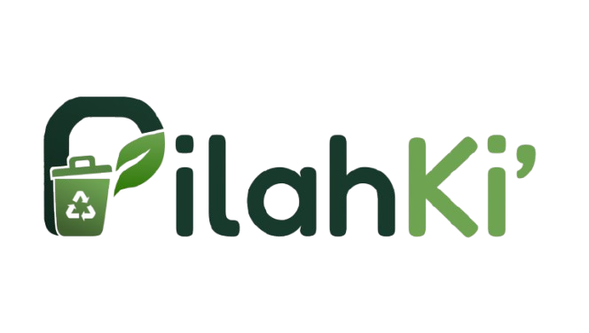

<div align="center">

  

  # PilahKi'
  ### Mulai dari Pilahan, Ciptakan Perubahan

  Platform digital terpadu edukasi pemilahan sampah, pemetaan bank sampah, jadwal armada angkut, dan asisten cerdas berbasis AI untuk mewujudkan Kota Makassar yang bersih, sehat, dan berkelanjutan.

  <br />

  [](https://vuejs.org/)
  [](https://vitejs.dev/)
  [](https://tailwindcss.com/)
  [](https://ai.google.dev/)
  [](https://supabase.com/)
  [](https://vercel.com/)

</div>

---

## Daftar Isi
- [Tentang Platform](#tentang-platform)
- [Latar Belakang Masalah](#latar-belakang-masalah)
- [Visi dan Misi](#visi-dan-misi)
- [Fitur Utama](#fitur-utama)
- [Dukungan terhadap SDGs](#dukungan-terhadap-sdgs)
- [Arsitektur dan Teknologi](#arsitektur-dan-teknologi)
- [Panduan Instalasi Lokal](#panduan-instalasi-lokal)
- [Struktur Direktori Proyek](#struktur-direktori-proyek)
- [Keamanan dan Praktik Deployment](#keamanan-dan-praktik-deployment)
- [Tim Pengembang](#tim-pengembang)

---

## Tentang Platform

**PilahKi'** adalah aplikasi berbasis web (*Single Page Application*) yang dirancang untuk mengatasi krisis pengelolaan sampah perkotaan langsung dari sumber utamanya: **rumah tangga**. 

Mengambil konteks percontohan di Kota Makassar, PilahKi' menghubungkan masyarakat dengan ekosistem pengelolaan sampah lokal melalui penyediaan data kategorisasi sampah instan, direktori lokasi fasilitas (Bank Sampah Unit, TPS 3R, dan TPA), transparansi jadwal armada pengangkut, panduan gaya hidup minim sampah, serta asisten percakapan cerdas **PilahAI** yang ditenagai oleh *Large Language Model* (LLM) Google Gemini dengan kemampuan pemanggilan fungsi (*Function Calling*).

---

## Latar Belakang Masalah

Meskipun kesadaran masyarakat mengenai kebersihan lingkungan semakin meningkat, pelaksanaan pemilahan sampah harian masih menghadapi empat kendala utama di lapangan:

1. **Kebingungan Identifikasi Sampah**  
   Masyarakat kerap kesulitan membedakan sampah organik, anorganik layak daur ulang, residu, dan limbah berbahaya (B3) serta prosedur penanganan yang aman sebelum dibuang.
2. **Keterbatasan Informasi Fasilitas**  
   Informasi letak Bank Sampah Unit (BSU), jam operasional, jenis komoditas sampah yang diterima, dan kontak pengurus masih tersebar dan sulit ditemukan.
3. **Jadwal Pengangkutan yang Tidak Transparan**  
   Ketidakpastian hari dan jam operasional armada truk/motor sampah kelurahan sering menyebabkan sampah menumpuk di depan rumah warga hingga membusuk dan mencemari sanitasi pemukiman.
4. **Kebuntuan Jalur Distribusi Sampah Daur Ulang**  
   Warga yang telah memilah sampah secara mandiri sering tidak mengetahui ke mana hasil pilahan bernilai ekonomis dapat disalurkan, sehingga akhirnya kembali tercampur dan bermuara ke Tempat Pemrosesan Akhir (TPA).

---

## Visi dan Misi

### Visi
> **"Mewujudkan kota yang bersih, sehat, dan berketahanan lingkungan melalui transformasi tata kelola sampah terdesentralisasi dari tingkat rumah tangga yang diperkuat oleh teknologi digital inklusif."**

### Misi
* **Misi Edukatif**: Membekali warga dengan literasi lingkungan praktis mengenai klasifikasi 4 kategori sampah utama dan teknik pemilahan yang tepat.
* **Misi Transparansi**: Menyediakan akses data terbuka dan terintegrasi terkait lokasi fasilitas daur ulang serta jadwal operasional armada kebersihan wilayah.
* **Misi Kolaboratif**: Menghubungkan bank sampah unit warga dengan sistem logistik kota demi mengoptimalkan sirkularitas ekonomi limbah.
* **Misi Aksesibilitas Berbasis Kecerdasan Buatan**: Mengintegrasikan asisten cerdas PilahAI untuk mempermudah konsultasi persampahan tanpa hambatan teknis bagi semua lapisan warga.
* **Misi Keberlanjutan Lingkungan**: Berkontribusi secara terukur dalam pengurangan timbulan sampah ke TPA Tamangapa demi mendukung masa depan perkotaan yang berkelanjutan.

---

## Fitur Utama

| Fitur | Deskripsi Singkat | Manfaat bagi Warga |
| :--- | :--- | :--- |
| **Pilah Sampah** | Mesin pencarian dan direktori klasifikasi sampah (Organik, Anorganik, B3, Residu). | Menghilangkan keraguan warga dalam menentukan kategori sampah dan cara penanganannya secara aman. |
| **Cari Lokasi** | Peta interaktif berbasis Leaflet dengan deteksi GPS dan filter kecamatan di Makassar. | Menemukan Bank Sampah terdekat, TPS 3R, jam operasional, kontak, dan rute navigasi. |
| **Jadwal Angkut** | Pemantauan jadwal armada pengangkut harian per kecamatan serta jadwal jemput Bank Sampah Unit. | Memberikan kepastian waktu pengangkutan sampah sehingga sanitasi pekarangan warga terjaga. |
| **Panduan Edukasi** | Modul edukasi mendalam, infografis langkah demi langkah, dan teknik komposting rumahan. | Membangun kebiasaan hidup minim sampah (*zero waste*) yang aplikatif dalam kehidupan sehari-hari. |
| **PilahAI Companion** | Asisten AI generatif (Gemini 2.5 Flash) dengan integrasi data spesifik Kota Makassar. | Menjawab pertanyaan seputar sampah, rekomendasi lokasi, dan jadwal secara langsung melalui obrolan ramah. |

---

## Dukungan terhadap SDGs

Inisiatif PilahKi' selaras dan berkontribusi langsung pada pencapaian **Sustainable Development Goals (SDGs)**:

* **SDG 11: Kota dan Permukiman yang Berkelanjutan**  
  Mengurangi dampak lingkungan perkotaan yang merugikan per kapita melalui pemantauan kualitas sanitasi pemukiman dan pengelolaan sampah terpadu di Kota Makassar.

---

## Arsitektur dan Teknologi

### Tech Stack
* **Frontend Framework**: [Vue.js 3](https://vuejs.org/) (Composition API, `<script setup>`)
* **Build Tool**: [Vite](https://vitejs.dev/)
* **Routing**: [Vue Router 4](https://router.vuejs.org/) dengan *Navigation Guards* & proteksi rute autentikasi
* **Styling & Desain**: [Tailwind CSS v4](https://tailwindcss.com/) dengan palet warna ramah lingkungan (*Forest Green theme*)
* **Peta Interaktif**: [Leaflet.js](https://leafletjs.com/) dengan OpenStreetMap tiles
* **Komponen Ikon**: [Lucide Icons](https://lucide.dev/)
* **Kecerdasan Buatan**: [Google Gemini AI API](https://ai.google.dev/) (Model: `gemini-2.5-flash` dengan fallback `gemini-2.0-flash`)
* **Backend & Autentikasi**: [Supabase](https://supabase.com/) (Auth, PostgreSQL Database, Row-Level Security)
* **Hosting Platform**: [Vercel](https://vercel.com/) (Global Edge Network)

---

## Panduan Instalasi Lokal

### Prasyarat Sistem
Pastikan perangkat Anda telah terinstal:
* **Node.js** versi 18.0.0 atau yang lebih baru
* **npm** atau **yarn** / **pnpm**
* **Git**

### 1. Kloning Repositori
```bash
git clone https://github.com/fayyadhmuwaffaq/pilahki.git
cd pilahki
```

### 2. Pasang Dependensi
```bash
npm install
```

### 3. Konfigurasi Variabel Lingkungan
Salin file template lingkungan `.env.example` menjadi `.env`:
```bash
cp .env.example .env
```

Buka file `.env` lalu sesuaikan nilai variabel konfigurasi berikut:
```env
# Konfigurasi Supabase
VITE_SUPABASE_URL="https://your-project-id.supabase.co"
VITE_SUPABASE_PUBLISHABLE_KEY="your-supabase-publishable-key"

# Konfigurasi Google Gemini API
VITE_GEMINI_API_KEY="your-google-gemini-api-key"
```

### 4. Jalankan Server Pengembangan
```bash
npm run dev
```
Buka peramban dan akses alamat lokal yang ditampilkan pada terminal (biasanya `http://localhost:5173`).

### 5. Membangun untuk Produksi
```bash
npm run build
```
Hasil kompilasi siap produksi akan tersedia di direktori `dist/`.

---

## Struktur Direktori Proyek

```text
pilahki/
├── public/
│   ├── img/                   # Asset gambar, infografis, dan logo aplikasi
│   └── favicon.ico
├── src/
│   ├── assets/                # Asset statis internal
│   ├── components/            # Komponen antarmuka yang dapat digunakan ulang
│   │   ├── FloatingPilahAi.vue    # Widget floating chatbot PilahAI
│   │   ├── Footer.vue             # Komponen kaki halaman
│   │   ├── GuideDetailModal.vue   # Modal pembaca detail panduan
│   │   ├── MobileBottomNav.vue    # Bilah navigasi bawah untuk perangkat bergerak
│   │   ├── Navbar.vue             # Bilah navigasi atas responsif
│   │   └── ProfileModal.vue       # Modal profil warga & pengaturan domisili
│   ├── composables/           # Logika reaktif Vue (useAuth, useDomicile)
│   ├── config/                # Konfigurasi global aplikasi
│   ├── data/                  # Dataset lokal persampahan & fasilitas Makassar
│   ├── lib/                   # Inisialisasi library eksternal (Supabase Client)
│   ├── router/                # Konfigurasi rute halaman & navigation guards
│   ├── services/              # Layanan integrasi eksternal (Gemini Service)
│   ├── views/                 # Halaman utama aplikasi
│   │   ├── auth/              # Halaman Login dan Register
│   │   ├── JadwalView.vue     # Halaman pemantauan jadwal angkut
│   │   ├── LandingView.vue    # Halaman beranda informasi publik
│   │   ├── LokasiView.vue     # Halaman peta dan direktori fasilitas
│   │   ├── PanduanView.vue    # Halaman pusat edukasi persampahan
│   │   ├── PilahAiView.vue    # Halaman penuh interaksi PilahAI
│   │   └── PilahView.vue      # Halaman katalog pemilahan sampah
│   ├── App.vue                # Komponen root aplikasi
│   ├── main.js                # Titik masuk utama aplikasi Vue
│   └── style.css              # Konfigurasi Tailwind CSS & gaya tema global
├── index.html                 # Template dokumen HTML
├── package.json               # Daftar pustaka dan script proyek
├── vercel.json                # Konfigurasi deployment & rewrite SPA Vercel
└── vite.config.js             # Konfigurasi build Vite
```

---

## Keamanan dan Praktik Deployment

Aplikasi ini dioptimalkan untuk di-deploy pada platform **Vercel**:
* **Proteksi Akses Halaman**: Rute internal aplikasi dilindungi menggunakan *Vue Router Navigation Guards* yang secara otomatis mencegat akses pengguna yang belum masuk ke sistem.
* **Keamanan Basis Data**: Memanfaatkan integrasi otentikasi Supabase dengan kebijakan *Row Level Security* (RLS).
* **Mitigasi Serangan**: Didukung oleh jaringan Vercel Edge Network yang dilengkapi dengan sistem mitigasi DDoS terdistribusi.

---

## Tim Pengembang

PilahKi' dikembangkan dengan dedikasi penuh oleh tim **BINFINITY** sebagai kontribusi nyata bagi transformasi lingkungan perkotaan yang berkelanjutan di Indonesia:

* **Organisasi**: BINFINITY
* **Lokasi Riset & Percontohan**: Kota Makassar, Sulawesi Selatan, Indonesia

---

<div align="center">
  <sub>Dibuat dengan komitmen menjaga kelestarian bumi dan lingkungan Kota Makassar.</sub><br />
  <sub>&copy; 2026 PilahKi' by BINFINITY. Hak Cipta Dilindungi Undang-Undang.</sub>
</div>
